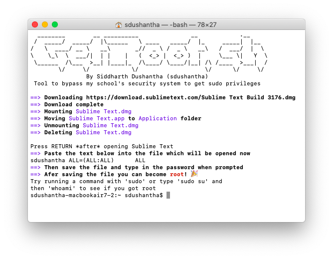

# getroot
>Tool to bypass my school's security system to get sudo privileges on MacOS

<p align="center">

</p>

## 🔨 Usage

```bash
# clone the repo
$ git clone https://github.com/sdushantha/getroot.git

# change the working directory to getroot
$ cd getroot

# run the script
$ sh getroot.sh
```

## 🤔 FAQ

### Why am I not getting root?
Ok, I made this script based on my school's security system, not yours. So it is not gaurented that this will work on your Mac.
My school uses a few profiles which can be found in Settings > Profiles. They use, *MDM Profile*, *Student Preference Restriction* and *FileVault Recovery*

### I am getting this error ```Unable to find application named 'Sublime Text.app/'```
You are most likly getting this error because you did not open Sublime Text like you were asked to. You have to open Sublime Text and then press enter on the Terminal.

## :scroll: License
MIT License

Copyright (c) 2018 Siddharth Dushantha
